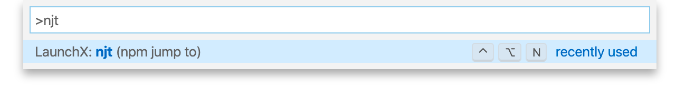

<h2 align="center"> 🐸 njt 🐸</h2>

<p align="center">
<b>🐸 npm jump to 🐸</b><br/>
<a href="https://njt.now.sh">njt.now.sh</a>
</p>

Are you typing npm package names in your search engine to then manually navigate to their source, homepage, changelog, versions and so on? 🕐🕑🕒🕓🕔

[Save five seconds thousands of times](https://xkcd.com/1205/) by quickly jumping to the right URL!
Here is a magic spell to remember:

```txt
🐸✨🐸✨🐸
njt <package> [destination]
🐸✨🐸✨🐸
```

## Available destinations

<!-- When updating, remember to reflect changes in cli/cli.js and src/ui/PageContentsForIndex/AvailableDestinations.tsx -->

- `b` → package cost estimation on [bundlephobia.com](https://bundlephobia.com)
- `c` → changelog
- `g` → github (gitlab, etc.) repository root
- `h` → homepage (aliased as `w` for website or `d` for docs)
- `i` → issues
- `n` → package info on [npmjs.com](https://www.npmjs.com)
- `p` → pull requests (aliased as `m` for merge requests)
- `r` → list of github releases
- `s` → source (often same as repository root, but can be its subdirectory in case of a monorepo)
- `t` → list of git tags
- `u` → package contents preview on [unpkg.com](https://unpkg.com)
- `v` → list of package versions with dates on [npmjs.com](https://www.npmjs.com)
- `y` → package page on [yarnpkg.com](https://yarnpkg.com) (mirror registry for [npmjs.com](https://www.npmjs.com))

Omitting the destination or entering an non-existing one takes you to the package page on [npmjs.com](https://www.npmjs.com) as if you used `n`.

## Examples

`njt prettier` (no specified destination)  
🐸 → <https://www.npmjs.com/package/prettier>

`njt prettier h` (homepage)  
🐸 → <https://prettier.io>

`njt prettier s` (source)  
🐸 → <https://github.com/prettier/prettier>

`njt prettier r` (releases)  
🐸 → <https://github.com/prettier/prettier/releases>

`njt prettier y` (yarn)  
🐸 → <https://yarnpkg.com/package/prettier>

## Getting `njt`

There are several environments in which you can access `njt`.
Pick your favourite or use ’em all!

### 🟢 Command-line tool

Install `njt` globally [from npm](https://www.npmjs.com/package/njt) by running this command in your terminal:

```bash
npm install --global njt
```

You are all set.
Now try executing `njt <package> [destination]` with some real arguments.
For example, these two commands will take you to the Lodash **g**ithub repo and **h**omepage, respectively:

```bash
njt lodash g
njt lodash h
```

A list of supported destinations will be shown if you launch `njt` without arguments.

To uninstall, run `npm remove --global njt`.
To reinstall or upgrade, run `npm install --global njt` again.

**Pro tip 💡** When you specify `.` instead of a package name, `njt` takes the name from the nearest `package.json` file.

**Pro tip 💡** To customise which browser you want to open, set an environment variable called `NJT_BROWSER` (or just `BROWSER`) with the app name of your choice.
The value [may vary](https://www.npmjs.com/package/open#app) based on your OS.
Note that setting `BROWSER` instead of `NJT_BROWSER` can affect other tools, which may or may not be desired.

### 🟢 Custom search engine in Chrome

1.  Open Chrome settings, e.g. by navigating to `chrome://settings`
1.  Navigate to _Manage search engines_ section (e.g. by typing its name in the _Search settings_ field)
1.  Click _Add_ next to _Other search engines_
1.  Fill in the _Add search engine_ form:

    | Field                         | Value                                       |
    | ----------------------------- | ------------------------------------------- |
    | Search engine                 | `njt (npm jump to)`                         |
    | Keyword                       | `njt`                                       |
    | Url with %s in place of query | `https://njt.now.sh/jump?from=chrome&to=%s` |

1.  Press _Add_

From now on, typing `njt <package> [destination]` in the address bar will take you directly to a page you want.
For example, `njt react h` will take you to the [React.js homepage](https://reactjs.org).

To uninstall, open _Manage search engines_ section in Chrome settings, click on three dots next to _Other search engines → njt_ and hit _Remove from list_.

**Pro tip 💡** You can use `n` instead of `njt` as a keyword to avoid typing two extra characters each time.
The command to type in Chrome address bar will become `n <package> [destination]` 🚀

### 🟢 Search bookmark in Firefox

You can use `njt` right from the address bar in Firefox.

1.  Open [njt.now.sh](https://njt.now.sh)
1.  Right-click on the search input field
1.  In the context menu, select _Add Keyword for this Search..._
1.  You’ll see a small form; type `njt` into the _Keyword_ field
1.  Press _Save_

From now on, typing `njt <package> [destination]` in the address bar will take you directly to a page you want.
For example, `njt react h` will take you to the [React.js homepage](https://reactjs.org).

To uninstall, open Firefox bookmarks from the main menu, search for `njt` and remove the bookmark.

**Pro tip 💡** You can use `n` instead of `njt` as a search keyword to avoid typing two extra characters each time.
The command to type in Firefox address bar will become `n <package> [destination]` 🚀

### 🟢 Alfred web search

Want to hop directly from [Alfred launcher](https://www.alfredapp.com/)?

1.  Open _Preferences_ → _Features_ → _Web Search_
1.  Click _Add Custom Search_
1.  Fill in the form:

    | Field      | Value                                            |
    | ---------- | ------------------------------------------------ |
    | Search URL | `https://njt.now.sh/jump?from=alfred&to={query}` |
    | Title      | `Search njt for '{query}'`                       |
    | Keyword    | `njt`                                            |
    | Icon       | drag from <https://njt.now.sh/favicon-32x32.png> |

1.  Press _Save_

Alternatively, copy and open this special Alfred link to get all the above steps done for you:

```txt
alfred://customsearch/Search%20njt%20for%20%27%7Bquery%7D%27/njt/utf8/nospace/https%3A%2F%2Fnjt.now.sh%2Fjump%3Ffrom%3Dalfred%26to%3D%7Bquery%7D
```

**Pro tip 💡** You can use `n` instead of `njt` as a search keyword to avoid typing two extra characters each time.
The command to type in Alfred address bar will become `n <package> [destination]` 🚀

You can also create variants with your favorite `njt` suffixes to jump to your favorite locations in even fewer characters.
For example, keyword `ng` can be a shortcut to `njt {query} g`.

### 🟢 VSCode

If you use Visual Studio Code, you can add njt to the command palette via [LaunchX](https://marketplace.visualstudio.com/items?itemName=neibla.launchx) extension.

1.  [Install the extension](vscode:extension/neibla.launchx)

1.  Open the command palette

1.  Type `njt` and press Enter

    

1.  Type your search and press Enter again

**Pro tip 💡** Use `ctrl+alt+n` to bypass the command palette.

### 🟢 DuckDuckGo bang

> DuckDuckGo bang is awaiting approval

<s>If you use [duckduckgo.com](https://duckduckgo.com) as your primary search engine, type `!njt <package> [destination]` in its search field (note the leading exclamation mark).
This trick is possible thanks to DuckDuckGo’s awesome [bang feature](https://duckduckgo.com/bang).</s>

### 🟢 Online search field on the `njt`’s mini-website

Open [njt.now.sh](https://njt.now.sh), type your query, press Enter.
This method is a bit slower than the other ones because it involves opening a web page with an input form.
On the plus side, it works everywhere and does not require setup.

Thanks to [now.sh](https://now.sh) for hosting [njt.now.sh](https://njt.now.sh) 💚

### ❓More ways

Are you a search shortcut guru?
Feel free [to suggest](https://github.com/kachkaev/njt/issues/new?title=New+entry+point+suggestion) another entry point to `njt` and save people’s time around the world!

## How does `njt` work

For requests like `njt <package>` or `njt <package> y`, all the tool does is navigating you to URLs like `https://www.npmjs.com/package/<package>` or `https://yarnpkg.com/package/<package>`.

Most other cases involve a look into `package.json` for the latest published version.
This file contains the location of the repository, the homepage and some other fields, which `njt` uses to construct the destination URL.

The command line version of the tool takes you to `https://njt.now.sh/jump?from=cli@VERSION&to=YOUR_QUERY`, from which you are redirected to the destination.

## Prior art

Shortcuts to some of the `njt` destinations are built into `npm` cli:

📦 [`npm home <package>` or `npm docs <package>`](https://docs.npmjs.com/cli/docs)  
⭥  
🐸 `njt <package> h` (homepage)

---

📦 [`npm issues <package>` or `npm bugs <package>`](https://docs.npmjs.com/cli/bugs)  
⭥  
🐸 `njt <package> i` (issues)

---

📦 [`npm repo <package>`](https://docs.npmjs.com/cli/repo)  
⭥  
🐸 `njt <package> g` (github, gitlab, etc. repo)

With `njt`, you have access to more shortcuts in multiple environments, which makes you more productive day to day.
